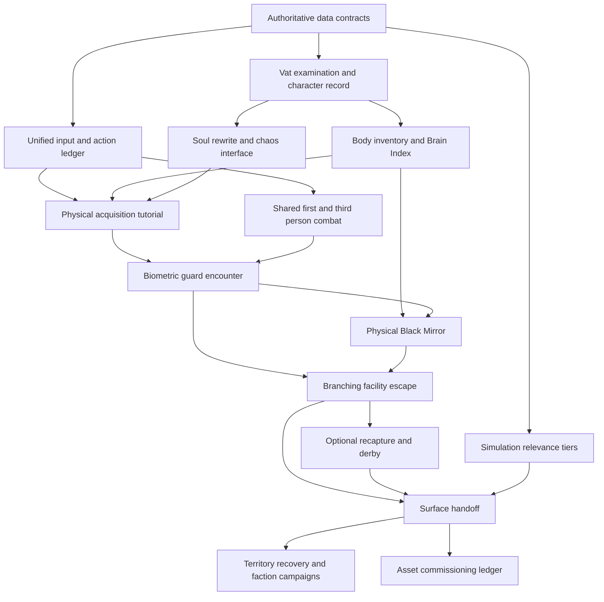

# Authoritative mechanics and implementation map

Updated from Greg's 19 September 2026 design interview. This replaces the
Derby-era system map. `DESIGN.md` remains the broad game brief,
`CHECKLIST.md` remains the detailed ledger, and the player-direction interview
preserves spoken decisions. This file shows dependencies and divides work
without letting parallel agents invent incompatible versions of the game.

## Product contract

- Single-player first. Multiplayer is a later product built from a finished
  single-player game, not a constraint on current work.
- One authored persistent world per save: main story, ending and playable
  post-game. It is not a roguelike and there are no “runs.”
- Ordinary play targets 60 FPS, preferably higher. The working hardware
  reference is Greg's RTX 2060 SUPER; cross-machine minimum spec comes later.
- Nearby simulation supports roughly 5–20 fully realised people depending on
  density. Distant people keep identity, relationships, destinations and world
  consequences while animation, anatomy, reasoning and routing become cheaper.
- The body is the health bar. No rigid enemy tiers or arbitrary boss-health
  multipliers: visible anatomy, armour, implants, mutation and regeneration
  explain survival.
- Interfaces teach themselves through physical use. Tutorial cards are the
  fallback, not the spine.

## Whole-game mechanics mind map

```mermaid
mindmap
  root((WIZARDS ONLY FOOLS))
    PLAYER BODY
      Character creation in the vat
        Body face proportions and origin
        Institutional classification
        Anatomical options and censorship
        Personality instrument and natal data
        Reusable presets
      Anatomy
        Tissue bone organs and blood
        Implants prosthetics wounds and pain
        Mutation and regeneration
      Equipment
        Clothing armour and body slots
        Weapons attachments and condition
        Organs limbs devices and objects
      Survival
        Meaningful stamina costs
        Exhaustion stresses consciousness muscle and heart
        Contextual lungs and contamination
    OPENING FACILITY
      Examination
        Cruel sympathetic government doctor
        Brain interface exposes answers
        Government diagnosis may be politically wrong
      Soul breakthrough
        Player's own soul and inner demon
        No external granting presence
        Chaos magick rewrites government implant
      Physical teaching sequence
        Broken medical restraint or tool
        Humiliation clothing from failed subject
        Biometric guard problem
        Limited firearm
        Prototype Black Mirror theft
      Escape routes
        Stealth exploration and cooperation
        Difficult direct assault
        Recapture and underground derby
        Mastery route avoids derby
        Different surface exits and relationships
      Doctor rivalry
        Reach is optional not a forced timer
        Apparent kill is remembered
        Medical reconstruction carries scars and memory
    PERSPECTIVE AND MOVEMENT
      First person
        Precision shooting positioning inspection and hand magic
      Third person
        External micro-camera and sensor projection
        Hardware exists from the start
        Chaos rewrite exposes control
        Lock-on combos dodges throws and executions
        Darkness injury interference and tight spaces disrupt it
      Shared physical truth
        Same anatomy wound depth and ballistics
        Camera never changes bullet damage
      Traversal
        Jump crouch sprint dodge vault climb wall-run grapple
    COMBAT
      Melee
        Weapon physics momentum footing guard and hitstop
        Nioh-like stance tree
      Grappling
        Mouse plus movement direction
        Grab pull push turn restrain and strike
        Learned throws and takedowns
      Firearms
        Scarce weapons and ammunition
        Crafting and salvage upgrades
        Penetration reads round tissue armour and angle
        Decisive brain heart spine and blood outcomes
      Presentation
        Directional reactions
        Selective lethal slow-motion X-ray
        Gore persists decays and returns to ecology
      Social encounters
        Most strangers cautious or neutral
        Conduct faction fear and proximity drive escalation
    WORLD POPULATION
      Near simulation
        Full body AI speech and relationships
        Five to twenty according to place
      Far simulation
        Identity destination faction and memory persist
        Reduced animation anatomy thought and route frequency
        Seamless promotion near the player
      Travel ecology
        Lone wanderers caravans patrols raiders refugees and workers
      Persistence
        Bodies limbs brass and wreckage remain for minutes
        Rot scavenging and environmental decay
        Important scars survive unloading
    INTERFACE
      Contextual field HUD
        Quiet while safe
        Wakes for wounds exhaustion lungs threats and navigation
        Frame cracks contaminates and misregisters
      Unified inventory
        Real dressed wounded player model
        Body clothing armour organs weapons and stances
        Brain opens Brain Index
      Brain Index
        Memories character record and neural data
        Working theories and conspiracy board
      Physical inspection and body search
        Shared input bespoke choreography
        Pockets clothing weapons implants organs and memories
        World remains dangerous
    BLACK MIRROR
      Stolen restricted prototype
      Cannot be discarded
      Player gradually hacks government control away
      Held physically in the live world
      Enlarged view preserves danger
      Map
        Physical geography remains useful
        Knowledge can be incomplete or outdated
        Government markers may manipulate or trap
        Source and confidence remain visible
      CellOutz and the Wire
        celloutz xyz is referenced then fictionalised
        Jobs bounties surveillance and relationships
    TERRITORY
      Vocabulary
        Territory settlement district outpost base camp facility
      States
        Oppressed disrupted vacuum recovering secured contested
        Reoccupied or desolated then scarred recovery
      Player choices
        Local self-rule install faction or direct government
        Help occupier leave vacuum extract or desolate
      Recovery
        Player sets broad priorities
        People and resources rebuild structures
        Population trade services lights and defence return
      Conflict
        Authored invasions simulated campaigns and retaliation
        Direct government attracts attention
      Large battles
        Preparation leaders objectives and tactical commands
    FACTIONS AND PEOPLE
      Separate changing hierarchies
        Government military elites raiders demons angels
      Persistent individuals
        Memory wounds grudges loyalty rank and succession
        Revival or body replacement can preserve identity
      Dialogue
        Proximity voice first
        Authored text alternative underneath
    COSMOLOGY AND PROGRESSION
      Soul bound to Earth
      Freedom from Godhead and repeated rebirth
      Chaos magick from rewritten implant
      Natal chart
        Integrated creation component
        Real ephemeris positions desired
        Planetary favour is different not strictly superior
      Death fiction
        Ordinary reload is current honest default
        Final immortality mechanism remains open
    ART AND ASSETS
      Build opening gameplay first
      Derive commissioning list from proven sockets
      Doctor failed subject vat body outfit tools guard phone facility
      Greg's art remains source material
```

## Implementation dependency graph

The critical path is data contracts → character record → embodied acquisition
→ biometric encounter → facility branches → surface handoff. Territory-scale
expansion does not block proving that path. The art ledger follows the sockets
the vertical slice proves instead of commissioning speculative assets first.

## Parallel ownership plan

These are work packages, not permission to dispatch blindly. Each lane gets
exclusive files or additive new files, a bounded deliverable and tests. The
integration lane alone edits shared scene routing and merges results.

| Lane | Scope | Verification gate |
|---|---|---|
| Opening narrative | Examination state machine, doctor record, creation beats | Deterministic examination, skip and save tests |
| Character/body | Persistent player schema, creation options, censorship presentation | Save migration and anatomy regressions |
| Inventory/interface | Unified body inventory and Brain Index composition | Mouse/keyboard navigation and live-danger tests |
| Facility interaction | Restraint, clothing, biometric access, acquisition sequence | Every access solution; no tutorial-card dependency |
| Combat/perspective | Shared hit truth, camera stance, exhaustion, grappling grammar | First/third parity, obstruction and input tests |
| Black Mirror | Prototype acquisition, held/enlarged states, map provenance | Live-world continuity and manipulated-source tests |
| Simulation/performance | Near/far tiers, persistence budgets and profiling | 5–20 near actors and 60 FPS evidence |
| Derby/route | Recapture branch and existing Derby continuity | Every branch reaches a recorded surface handoff |
| Integration | Shared scenes, migrations, checklist, demo and evidence | Full relevant suites plus recorded playthrough |

## Non-negotiable merge rules

1. Fast-forward every Orca worktree to the same integration commit.
2. One owner per shared production file. Prefer additive components; never send
   several agents into `bone_yard_hunt.gd` simultaneously.
3. Every lane states its player action, persistent record and visible proof.
4. Visual claims require actual scene evidence, not code inspection.
5. No lane invents lore to unblock itself. Use this map or report a genuine
   contradiction.
6. Integration reruns tests; worker-green is evidence, not merge authority.
7. Generated `.import` files and unrelated captures never enter feature commits.

## Intentionally open without blocking the slice

- final player death/revival fiction; ordinary reload is honest for now;
- the examiner's true name/history; the opening presents an unknown office;
- final micro-drone model and later free-flight capability;
- recipient-specific grounded acts that transfer territory;
- permanent addiction balance;
- final angel–wizard relationship;
- cross-machine minimum spec and final distribution rating.

Do not reopen settled questions merely because implementation offers choices.
Choose the smallest reversible implementation consistent with this map.
