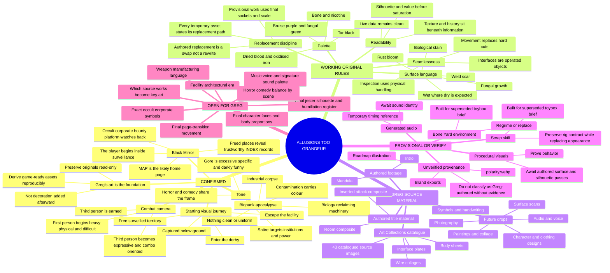
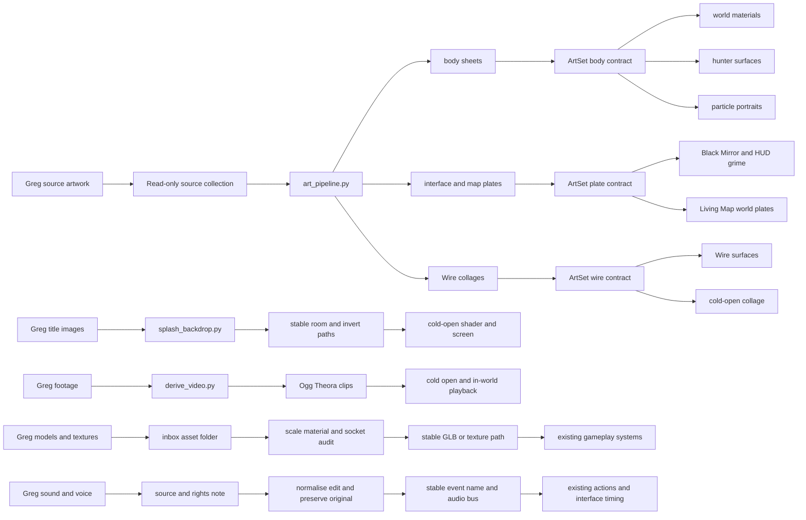

# AllusionsTooGrandeur art-direction mind map

This is the visual decision map for the project. It complements the prose in
`ART-DIRECTION.md`; it does not replace that document or turn references into
assets. Its purpose is to keep three different kinds of truth visibly apart:

- **CONFIRMED** — direction Greg has explicitly chosen;
- **WORKING** — an original implementation rule that can be used now without
  pretending it is final authored art;
- **OPEN** — a decision or provenance question that must come back to Greg.

Retail games and other artists appear only in the **REFERENCE** branch. They
describe qualities to study. They are never a source of portable art, names,
characters, layouts, animations, audio, models, or textures.

## 1. The whole visual language

## 2. Discipline map

Each branch distinguishes what is already safe to build from what still needs
an authored decision. “Reference” means a quality to analyse, never a recipe to
copy.

```mermaid
mindmap
  root((VISUAL DISCIPLINES))
    Interface
      CONFIRMED
        Black Mirror is cracked reflective glass
        MAP leads because territory is surveilled
        INDEX knowledge is earned through liberation
        Different corners have different bodily jobs
      WORKING
        CellOutz product grammar
        Chassis-owned page rails
        Photocopy grime and misregistration
        Live data above texture
      OPEN
        Shutter versus corruption versus occult carousel
        Final cursor hand and icon set
    Characters
      CONFIRMED
        Bodies retain injury replacement and history
        Silhouette must survive first and third person
      WORKING
        Specific anatomy instead of generic gore decals
        Power becomes visible through body change
      OPEN
        Final face language
        Species and mutation shape families
        Hero and rival authored designs
    Clothing
      CONFIRMED
        Forced humiliating jester gimp outfit
        Poofy cuffs and gloves remain visible in first person
        Costume belongs to elite control
      WORKING
        Black wine fabric
        Bone and blood cuffs
        Restraint hardware bells locked ruff
      OPEN
        Horror comedy ratio
        Exact cut materials and ornament
        Progression and damage variants
    Anatomy
      CONFIRMED
        Organs bones wounds and replacements are interface
        Smoking affects the persistent lungs
        Dismemberment is zone specific
      WORKING
        Wet tissue against clinical registration
        X-ray readability before decorative gore
        Shallow volumetric organ views expand into 3D
      OPEN
        Final organ model style
        Realism versus stylisation boundary
        Authored wound library
    Environments
      CONFIRMED
        Underground facility first
        Escape route then derby
        Ashbloom is overgrown irradiated infrastructure
      WORKING
        Long punishing sightlines above ground
        Cramped oppressive authored routes below ground
        Contamination is material not paint
      OPEN
        Facility age and original purpose
        Regional architecture families
        Shadow-realm appearance
    Vehicles
      CONFIRMED
        Derby vehicles show violence and persistent damage
        Cars look grown into rather than toy-like
      WORKING
        Exposed mechanism
        Grafted organic parts
        Bone sinew and fungal wheel wells
      OPEN
        Replacement body designs
        Manufacturer and faction silhouettes
        Final cockpit ornament
    Weapons
      CONFIRMED
        Every weapon is physically held inspected and aimed
        First-person handling is heavy and challenging
        Third-person play earns expressive combinations
      WORKING
        Wear mechanism and anatomy remain readable
        Customisation happens on the weapon
      OPEN
        Manufacturing language by faction
        Final silhouettes materials and animations
        Gun and melee progression balance
    Occult technology
      CONFIRMED
        Surveillance company is openly occult and satirically evil
        Black Mirror is a security instrument and cursed mirror
        Corporate bounties jobs and territory are connected
      WORKING
        Ritual diagrams function as controls
        Bureaucratic forms and sigils share one surface
        Technology looks back at its operator
      OPEN
        Company name seal and liturgy
        Which symbols are original canon
        Boundary between machinery and entity
    Animation
      CONFIRMED
        Movement replaces cuts
        Hands and forearms enter from believable body positions
        Objects use authored handling rather than one generic flourish
      WORKING
        Weight anticipation contact recovery
        Breathing wrist drift and material response
        Camera travel preserves the physical subject
      OPEN
        Final transition motion
        Animation exaggeration ceiling
        Signature locomotion for factions
    Lighting
      CONFIRMED
        The screen and lighter illuminate the body and world
        Daylight suppresses artificial glare
        Darkness is a mechanical risk
      WORKING
        Warm contaminated practicals
        Screen emission reflects page and battery state
        Saturation signals contamination or danger
      OPEN
        Facility baseline exposure
        Storm and shadow-realm extremes
        Final accessibility range
    Sound
      CONFIRMED
        Physical actions require material sound
        Page movement should use corruption rather than a generic UI beep
      WORKING
        Digital tearing
        Detuned data chatter
        Cracked-glass resonance
        Mechanism under electronic failure
      OPEN
        Musical language
        Corporate voice and station IDs
        Greg voice-processing rules
        Final transition mix and loudness
    Cinematography
      CONFIRMED
        First person begins uncomfortably close and physical
        Third person is an earned abstract view
        Transitions travel instead of teleporting
      WORKING
        Wide restrained fisheye
        Interfaces remain sharp while the world bows
        Damage and glass remain in the frame
      OPEN
        Unlock beat for third person
        Combat camera distance and aggression
        Cutscene authorship versus player control
```

## 3. Reference register versus original rules

| Reference influence | Quality Greg values | Original rule used here | Never imported |
| --- | --- | --- | --- |
| Cruelty Squad | hostile colour, body modification, very wide first-person pressure | saturation is scarce contamination; first-person closeness is bodily discomfort | palettes, UI layouts, characters, writing, assets |
| Wrought Flesh | organ-forward biopunk materiality | organs are persistent equipment and readable interface state | models, crafting loop, creatures, terminology |
| Kenshi | sun-destroyed bodies and lasting loss | injury and replacement remain visible in body and history | races, settlements, costumes, lore |
| S.T.A.L.K.E.R. | contamination and uncanny environmental threat | contamination is a material and visibility condition | locations, factions, anomalies, audio |
| Postal 2 | physical excess and deadpan institutional satire | violence and petty bureaucracy can occupy the same scene | jokes, characters, missions, dialogue |
| early Psychonauts | psychology expressed through spatial presentation | interface and camera change with bodily and mental state | level designs, characters, visual motifs |
| Soulslike combat | deliberate danger and earned mastery | first-person commitment grows into earned third-person expression | animations, enemies, combo data, encounter layouts |
| Shadow of Mordor | flowing third-person target transitions and expressive crowd combat | earned third-person can link readable authored attacks across threats | animations, characters, UI, executions, branded systems |

## 4. Existing asset audit

The audit was performed against the repository, the checked-in manifest, asset
consumer paths, and reproducible conversion scripts. “Verified Greg source” is
used only where a manifest or source script explicitly establishes it.

| Asset family | Evidence and current quantity | Current consumers | Status | Replacement seam without gameplay rewrite |
| --- | --- | --- | --- | --- |
| Greg source catalogue | `game/art/derived/manifest.json`: 43 catalogued images from the read-only `C:/Users/Greg/Desktop/Art Collections` collection | input to derived families below | **Verified Greg source** | add or revise originals in the source collection, then run `tools/art_pipeline.py`; originals remain untouched |
| Body sheets | `game/art/derived/body/`: 8 generated 512px tile sheets | `world_look.gd`, `hunter_appearance.gd`, `particle_portrait.gd` through `ArtSet.pick("body", seed)` | **Derived from Greg source** | preserve the `ArtSet` kind and add curated sheets or rebuild the pipeline output; no consumer changes |
| Interface and map plates | `game/art/derived/plate/`: 6 generated 1024×512 plates | `celloutz_grunge.gd`, `ashbloom_world_generator.gd` through `ArtSet.pick("plate", seed)` | **Derived from Greg source** | replace or expand plate outputs while preserving the `plate` kind; MAP and interface consumers continue resolving by seed |
| Wire collage | `game/art/derived/wire/`: 3 generated 768px collages | `celloutz_grunge.gd`, `boot_splash.gd` | **Derived from Greg source** | rebuild or curate `wire/collage_XX.png`; keep stable resource paths or extend `ArtSet` |
| Title room and invert | `splash_room.png`, `splash_invert.png`; source mapping is explicit in `tools/splash_backdrop.py` | `splash_backdrop.gd` | **Verified Greg source** | replace the two named source images or pass explicit `--room` and `--invert`; keep the derived resource names |
| Intro and mandala footage | 2 Ogg Theora clips in `game/art/derived/video/`; conversion contract in `tools/derive_video.py` | cold-open playback and `video_playback_test.gd` | **Verified Greg source** | transcode future footage to the same names for direct replacement, or add a named clip without changing the playback contract |
| Brand lockups | PNG/SVG families in `art/brand` and runtime copies in `game/art/brand` | `boot_splash.gd`, `country_town_menu.tscn`, reticle registration | **Provenance to verify** | replace runtime PNGs at their stable paths after Greg approves the source lockup; preserve safe margins and aspect |
| Scrap skiff | source `.blend`, `.glb`, previews in `art/scrap_skiff_v1`; runtime `game/art/scrap_skiff.glb` | Hunt, derby, prototype lab, arcade vehicle, wheel tests | **Provisional: superseded brief** | replace the runtime GLB while preserving origin, wheel contact dimensions, named parts, material slots and scale; existing physics and tests remain |
| Bone Yard environment | source `.blend`, `.glb`, preview in `art/bone_yard_v1`; runtime GLB | `rift_derby.gd` | **Provisional: superseded brief** | replace environment GLB at the stable path or retain node names expected by the derby; re-author materials toward the confirmed biopunk register |
| World Zero roadmap | `art/roadmap/world-zero-steam-roadmap-v1.png` | external presentation only | **Provenance and finality to verify** | treat as a planning image, not a game-world style source, until Greg confirms authorship and intended use |
| `polarity.webp` | one runtime texture used only by prototype lab | `prototype_lab/lab.gd` | **Provenance to verify** | do not promote beyond prototype use; replace at the stable path only after source and license are recorded |
| Procedural HUD, shaders and gore | code-native systems across `game/systems` and `game/shaders` | live game | **Working implementation, not final authored art** | keep behavior, data inputs, sockets and draw contracts; replace surface assets and silhouettes without replacing gameplay state |
| Generated or synthetic audio | system-level placeholders documented in `ART-DIRECTION.md` | action and interface timing | **Provisional** | authored recordings replace clips behind the same event names and buses; keep gameplay timing independent of waveform length |

### Audit limitation that matters

`tools/art_pipeline.py` currently uses the first eight successfully loaded files
for `body` and the first six for `plate`, in sorted source-path order. Adding a
new alphabetically earlier artwork can therefore change seeded selections even
though gameplay code is untouched. Before the collection becomes large, the
manifest should gain explicit curated roles rather than letting alphabetical
order decide which art becomes skin, world material, or interface. That is a
pipeline task, not an invitation to classify Greg's work without him.

## 5. Asset-intake routing map

## 6. Drop contracts

These are the smallest handoffs that let Greg's art become foundational without
forcing gameplay code to know where it came from.

### A two-dimensional artwork or photograph

Place the original in the read-only source collection and record:

- title and date;
- whether cropping, glitching, recolouring, tiling, animation, and text overlay
  are allowed;
- intended roles: `body`, `plate`, `wire`, key art, environment decal, or
  “unassigned — ask first”;
- focal regions that must not be cropped;
- whether faces, handwriting, signatures, and external copyrighted material
  may appear in the shipped crop.

The derived output enters through `ArtSet`; consumers do not need to change.

### A character, garment, weapon, vehicle, or environment model

Place it under `game/art/inbox/<asset-name>/` with:

- `.glb` preferred, plus the editable source if Greg wants it versioned;
- one neutral reference image and an intended real-world scale;
- named material slots;
- named grip, muzzle, wheel, damage, organ, limb, or attachment sockets relevant
  to the object;
- author/source/license note;
- which existing provisional asset it replaces.

After scale and socket verification, promote it to the existing stable runtime
path. Gameplay continues consuming the same contract.

### Audio, voice, and music

Keep the original recording read-only and provide:

- author/performer and usage permission;
- dry and processed versions when possible;
- intended event or character;
- whether looping, pitch variation, distortion, cutting, and layering are
  allowed;
- any words or performances that must remain intact.

Actions reference stable event names and buses, not filenames embedded across
gameplay code.

## 7. Decisions to bring back to Greg

These questions are deliberately narrower than “what should the art look
like?” and can be answered one at a time.

1. Which five works in the Art Collections folder are the visual constitution
   of the game—the pieces everything else must harmonise with?
2. May shipped crops retain recognisable third-party posters or covers visible
   inside collages and room photographs, or should those areas be replaced by
   Greg-authored material?
3. Which brand lockup is canonical, and which of its source files are Greg's
   approved originals?
4. Should the jester outfit first read as punishment, grotesque comedy, occult
   office uniform, or an even balance? The current construction supports all
   four but cannot choose the final silhouette honestly.
5. For the facility, which material dominates before contamination: poured
   concrete, institutional tile, buried corporate laboratory, repurposed civic
   infrastructure, or something Greg draws himself?
6. For page movement, does the next comparison select the mechanical shutter,
   cracked-glass corruption, or an occult carousel? Corruption sound is already
   the confirmed audio direction.
7. Which sounds can Greg record or perform personally—voice, breath, handling,
   impacts, room tone, radio fragments—so the sound layer has the same authorial
   ownership as the image layer?
8. When connected local work makes a holding `ready_for_decision`, what is the
   visible difference between liberation, bargaining, inheritance, ascent and
   corruption? The live MAP/INDEX/Board route deliberately preserves the old
   holder at that threshold, so no provisional colour or victory flourish may
   choose the recipient or imply a good/evil axis before Greg chooses the act.

Until these are answered, the project should continue improving systems,
replacement seams, staging, readability, and verified physical behavior rather
than manufacturing final-looking substitutes and letting them harden into the
style.
